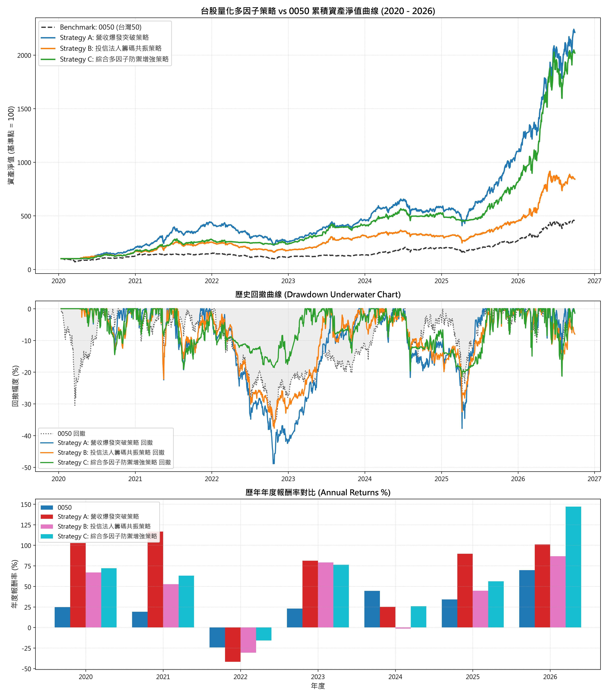

# 台股量化策略回測綜合研究報告

## 1. 策略績效指標對比表

| 策略名稱                           | 總報酬率 (%)   | 年化報酬 CAGR (%)   | 波動度 (%)   | 夏普值 Sharpe   | 最大回撤 MDD (%)   |   風暴比 Calmar | 月勝率 (%)   | Alpha (%)   |   Beta |
|:-----------------------------------|:---------------|:--------------------|:-------------|:----------------|:-------------------|----------------:|:-------------|:------------|-------:|
| Benchmark: 0050 Buy & Hold         | 354.29%        | 25.3%               | 23.06%       | -               | 36.38%             |            0.7  | -            | 0.00%       |   1    |
| Strategy A: 營收爆發突破策略       | 2111.75%       | 58.63%              | 27.62%       | 1.82            | 48.88%             |            1.2  | 68.75%       | 38.07%      |   0.8  |
| Strategy B: 投信法人籌碼共振策略   | 742.29%        | 37.38%              | 25.08%       | 1.38            | 37.67%             |            0.99 | 60.0%        | 18.86%      |   0.71 |
| Strategy C: 綜合多因子防禦增強策略 | 1918.66%       | 56.49%              | 25.27%       | 1.91            | 21.52%             |            2.63 | 63.75%       | 39.85%      |   0.64 |

## 2. 累計淨值與回撤走勢圖

## 3. 年度報酬分解

|      |   0050 |   Strategy A: 營收爆發突破策略 |   Strategy B: 投信法人籌碼共振策略 |   Strategy C: 綜合多因子防禦增強策略 |
|-----:|-------:|-------------------------------:|-----------------------------------:|-------------------------------------:|
| 2020 |  24.74 |                         102.73 |                              66.83 |                                72.01 |
| 2021 |  19.02 |                         116.6  |                              52.68 |                                63.07 |
| 2022 | -24.26 |                         -41.69 |                             -30.74 |                               -15.85 |
| 2023 |  22.91 |                          81.21 |                              79.14 |                                76.31 |
| 2024 |  44.52 |                          25.13 |                              -1.33 |                                25.8  |
| 2025 |  34.05 |                          89.64 |                              44.74 |                                56.13 |
| 2026 |  69.66 |                         100.88 |                              86.61 |                               146.97 |

