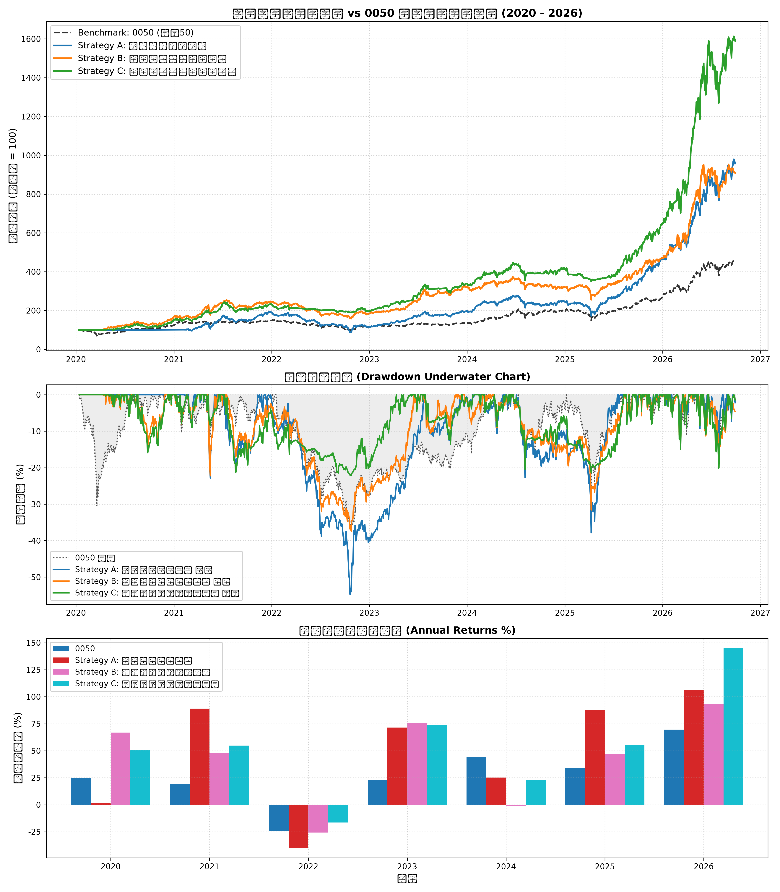

# 台股量化策略回測綜合研究報告

## 1. 策略績效指標對比表

| 策略名稱                           | 總報酬率 (%)   | 年化報酬 CAGR (%)   | 波動度 (%)   | 夏普值 Sharpe   | 最大回撤 MDD (%)   |   風暴比 Calmar | 月勝率 (%)   | Alpha (%)   |   Beta |
|:-----------------------------------|:---------------|:--------------------|:-------------|:----------------|:-------------------|----------------:|:-------------|:------------|-------:|
| Benchmark: 0050 Buy & Hold         | 354.29%        | 25.3%               | 23.06%       | -               | 36.38%             |            0.7  | -            | 0.00%       |   1    |
| Strategy A: 營收爆發突破策略       | 857.68%        | 40.03%              | 27.0%        | 1.37            | 54.73%             |            0.73 | 65.0%        | 21.08%      |   0.73 |
| Strategy B: 投信法人籌碼共振策略   | 808.68%        | 38.94%              | 25.23%       | 1.42            | 37.41%             |            1.04 | 60.0%        | 20.2%       |   0.72 |
| Strategy C: 綜合多因子防禦增強策略 | 1489.84%       | 51.02%              | 24.91%       | 1.78            | 22.18%             |            2.3  | 63.75%       | 34.44%      |   0.63 |

## 2. 累計淨值與回撤走勢圖

## 3. 年度報酬分解

|      |   0050 |   Strategy A: 營收爆發突破策略 |   Strategy B: 投信法人籌碼共振策略 |   Strategy C: 綜合多因子防禦增強策略 |
|-----:|-------:|-------------------------------:|-----------------------------------:|-------------------------------------:|
| 2020 |  24.74 |                           1.41 |                              66.83 |                                50.86 |
| 2021 |  19.02 |                          89.05 |                              47.99 |                                54.73 |
| 2022 | -24.26 |                         -39.96 |                             -25.71 |                               -16.41 |
| 2023 |  22.91 |                          71.46 |                              75.94 |                                73.96 |
| 2024 |  44.52 |                          25.2  |                              -0.87 |                                23.02 |
| 2025 |  34.05 |                          87.89 |                              47.15 |                                55.49 |
| 2026 |  69.66 |                         106.27 |                              93.03 |                               144.87 |

