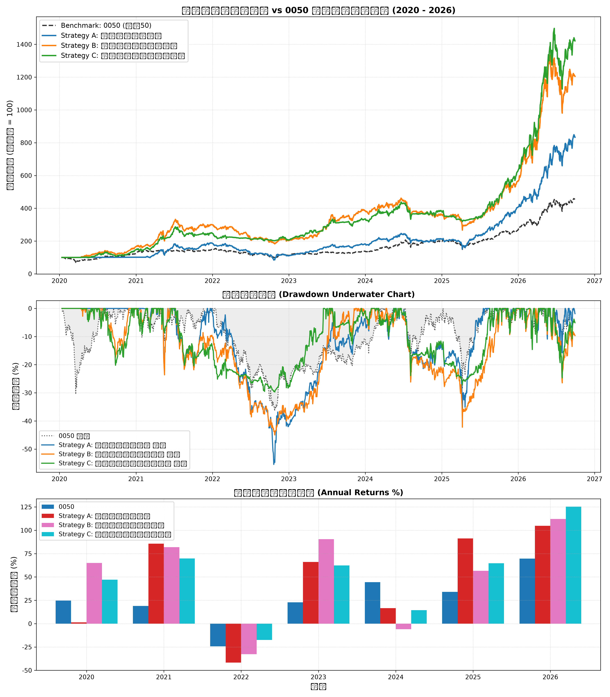

# 台股量化策略回測綜合研究報告

## 1. 策略績效指標對比表

| 策略名稱                           | 總報酬率 (%)   | 年化報酬 CAGR (%)   | 波動度 (%)   | 夏普值 Sharpe   | 最大回撤 MDD (%)   |   風暴比 Calmar | 月勝率 (%)   | Alpha (%)   |   Beta |
|:-----------------------------------|:---------------|:--------------------|:-------------|:----------------|:-------------------|----------------:|:-------------|:------------|-------:|
| Benchmark: 0050 Buy & Hold         | 354.29%        | 25.3%               | 23.06%       | -               | 36.38%             |            0.7  | -            | 0.00%       |   1    |
| Strategy A: 營收爆發突破策略       | 733.12%        | 37.15%              | 27.21%       | 1.29            | 55.45%             |            0.67 | 67.5%        | 18.24%      |   0.73 |
| Strategy B: 投信法人籌碼共振策略   | 1104.65%       | 44.9%               | 29.48%       | 1.4             | 44.99%             |            1    | 61.25%       | 24.19%      |   0.81 |
| Strategy C: 綜合多因子防禦增強策略 | 1321.07%       | 48.51%              | 25.87%       | 1.66            | 29.71%             |            1.63 | 60.0%        | 31.73%      |   0.64 |

## 2. 累計淨值與回撤走勢圖

## 3. 年度報酬分解

|      |   0050 |   Strategy A: 營收爆發突破策略 |   Strategy B: 投信法人籌碼共振策略 |   Strategy C: 綜合多因子防禦增強策略 |
|-----:|-------:|-------------------------------:|-----------------------------------:|-------------------------------------:|
| 2020 |  24.74 |                           1.41 |                              65.02 |                                47.07 |
| 2021 |  19.02 |                          85.6  |                              81.94 |                                69.75 |
| 2022 | -24.26 |                         -41.66 |                             -32.64 |                               -17.47 |
| 2023 |  22.91 |                          66.06 |                              90.52 |                                62.41 |
| 2024 |  44.52 |                          16.63 |                              -5.86 |                                14.42 |
| 2025 |  34.05 |                          91.24 |                              56.6  |                                64.69 |
| 2026 |  69.66 |                         104.86 |                             112.07 |                               125.39 |

