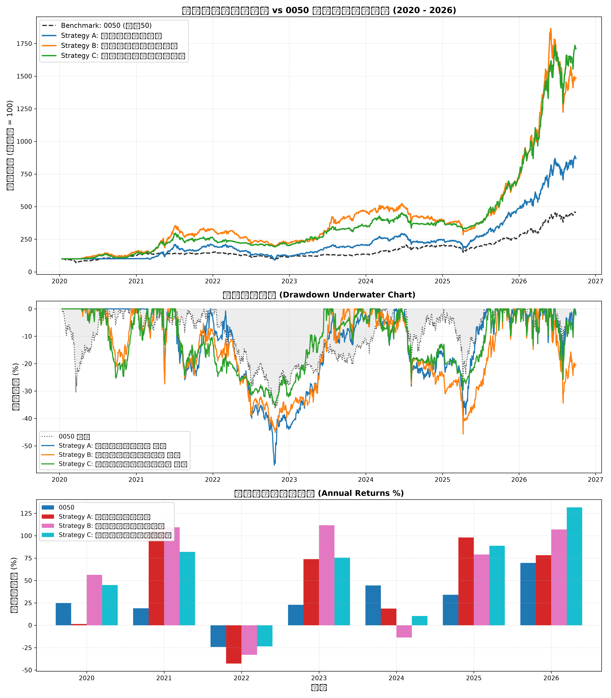

# 台股量化策略回測綜合研究報告

## 1. 策略績效指標對比表

| 策略名稱                           | 總報酬率 (%)   | 年化報酬 CAGR (%)   | 波動度 (%)   | 夏普值 Sharpe   | 最大回撤 MDD (%)   |   風暴比 Calmar | 月勝率 (%)   | Alpha (%)   |   Beta |
|:-----------------------------------|:---------------|:--------------------|:-------------|:----------------|:-------------------|----------------:|:-------------|:------------|-------:|
| Benchmark: 0050 Buy & Hold         | 354.29%        | 25.3%               | 23.06%       | -               | 36.38%             |            0.7  | -            | 0.00%       |   1    |
| Strategy A: 營收爆發突破策略       | 768.07%        | 38.0%               | 29.27%       | 1.24            | 57.01%             |            0.67 | 70.0%        | 18.79%      |   0.74 |
| Strategy B: 投信法人籌碼共振策略   | 1383.89%       | 49.47%              | 33.19%       | 1.38            | 45.68%             |            1.08 | 60.0%        | 28.06%      |   0.84 |
| Strategy C: 綜合多因子防禦增強策略 | 1610.13%       | 52.67%              | 28.68%       | 1.62            | 35.53%             |            1.48 | 60.0%        | 34.23%      |   0.71 |

## 2. 累計淨值與回撤走勢圖

## 3. 年度報酬分解

|      |   0050 |   Strategy A: 營收爆發突破策略 |   Strategy B: 投信法人籌碼共振策略 |   Strategy C: 綜合多因子防禦增強策略 |
|-----:|-------:|-------------------------------:|-----------------------------------:|-------------------------------------:|
| 2020 |  24.74 |                           1.41 |                              56.32 |                                45    |
| 2021 |  19.02 |                         105.32 |                             109.42 |                                82.02 |
| 2022 | -24.26 |                         -42.72 |                             -32.99 |                               -23.52 |
| 2023 |  22.91 |                          73.85 |                             111.64 |                                75.39 |
| 2024 |  44.52 |                          18.63 |                             -13.76 |                                10.42 |
| 2025 |  34.05 |                          98    |                              79.07 |                                88.79 |
| 2026 |  69.66 |                          78.23 |                             106.96 |                               131.73 |

