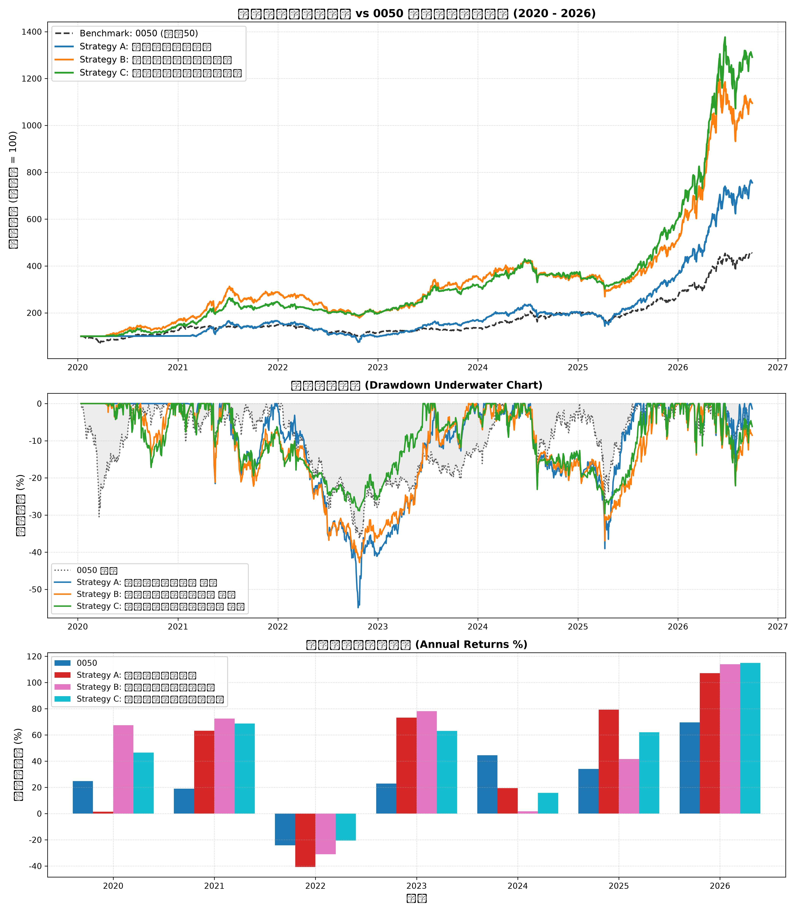

# 台股量化策略回測綜合研究報告

## 1. 策略績效指標對比表

| 策略名稱                           | 總報酬率 (%)   | 年化報酬 CAGR (%)   | 波動度 (%)   | 夏普值 Sharpe   | 最大回撤 MDD (%)   |   風暴比 Calmar | 月勝率 (%)   | Alpha (%)   |   Beta |
|:-----------------------------------|:---------------|:--------------------|:-------------|:----------------|:-------------------|----------------:|:-------------|:------------|-------:|
| Benchmark: 0050 Buy & Hold         | 354.29%        | 25.3%               | 23.06%       | -               | 36.38%             |            0.7  | -            | 0.00%       |   1    |
| Strategy A: 營收爆發突破策略       | 655.24%        | 35.16%              | 26.16%       | 1.27            | 54.95%             |            0.64 | 67.5%        | 16.54%      |   0.72 |
| Strategy B: 投信法人籌碼共振策略   | 994.82%        | 42.85%              | 27.48%       | 1.43            | 42.82%             |            1    | 63.75%       | 22.94%      |   0.77 |
| Strategy C: 綜合多因子防禦增強策略 | 1191.39%       | 46.41%              | 24.43%       | 1.68            | 29.65%             |            1.57 | 62.5%        | 28.98%      |   0.67 |

## 2. 累計淨值與回撤走勢圖

## 3. 年度報酬分解

|      |   0050 |   Strategy A: 營收爆發突破策略 |   Strategy B: 投信法人籌碼共振策略 |   Strategy C: 綜合多因子防禦增強策略 |
|-----:|-------:|-------------------------------:|-----------------------------------:|-------------------------------------:|
| 2020 |  24.74 |                           1.41 |                              67.47 |                                46.55 |
| 2021 |  19.02 |                          63.27 |                              72.46 |                                68.67 |
| 2022 | -24.26 |                         -40.71 |                             -31.02 |                               -20.61 |
| 2023 |  22.91 |                          73.29 |                              78.16 |                                63.07 |
| 2024 |  44.52 |                          19.47 |                               1.72 |                                15.74 |
| 2025 |  34.05 |                          79.39 |                              41.68 |                                62.12 |
| 2026 |  69.66 |                         107.17 |                             114.03 |                               115.06 |

