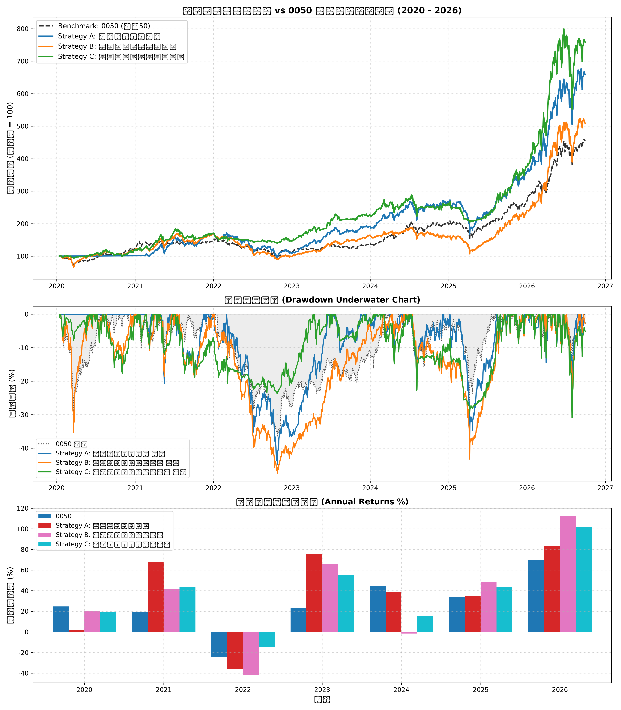

# 台股量化策略回測綜合研究報告

## 1. 策略績效指標對比表

| 策略名稱                           | 總報酬率 (%)   | 年化報酬 CAGR (%)   | 波動度 (%)   | 夏普值 Sharpe   | 最大回撤 MDD (%)   |   風暴比 Calmar | 月勝率 (%)   | Alpha (%)   |   Beta |
|:-----------------------------------|:---------------|:--------------------|:-------------|:----------------|:-------------------|----------------:|:-------------|:------------|-------:|
| Benchmark: 0050 Buy & Hold         | 354.29%        | 25.3%               | 23.06%       | -               | 36.38%             |            0.7  | -            | 0.00%       |   1    |
| Strategy A: 營收爆發突破策略       | 558.19%        | 32.42%              | 27.76%       | 1.14            | 44.76%             |            0.72 | 71.25%       | 13.06%      |   0.75 |
| Strategy B: 投信法人籌碼共振策略   | 408.68%        | 27.43%              | 27.92%       | 0.99            | 47.44%             |            0.58 | 62.5%        | 5.71%       |   0.85 |
| Strategy C: 綜合多因子防禦增強策略 | 657.96%        | 35.23%              | 27.24%       | 1.23            | 30.87%             |            1.14 | 56.25%       | 17.63%      |   0.68 |

## 2. 累計淨值與回撤走勢圖

## 3. 年度報酬分解

|      |   0050 |   Strategy A: 營收爆發突破策略 |   Strategy B: 投信法人籌碼共振策略 |   Strategy C: 綜合多因子防禦增強策略 |
|-----:|-------:|-------------------------------:|-----------------------------------:|-------------------------------------:|
| 2020 |  24.74 |                           1.41 |                              20.11 |                                19.01 |
| 2021 |  19.02 |                          67.75 |                              41.32 |                                43.97 |
| 2022 | -24.26 |                         -35.72 |                             -41.72 |                               -14.78 |
| 2023 |  22.91 |                          75.65 |                              65.81 |                                55.43 |
| 2024 |  44.52 |                          38.96 |                              -1.63 |                                15.35 |
| 2025 |  34.05 |                          34.82 |                              48.39 |                                43.69 |
| 2026 |  69.66 |                          82.92 |                             112.46 |                               101.49 |

